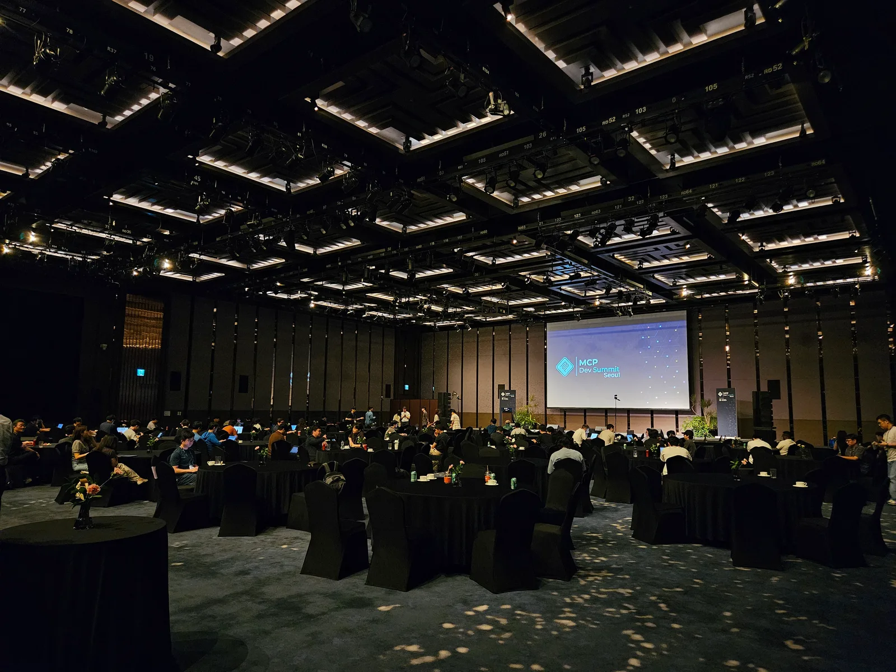
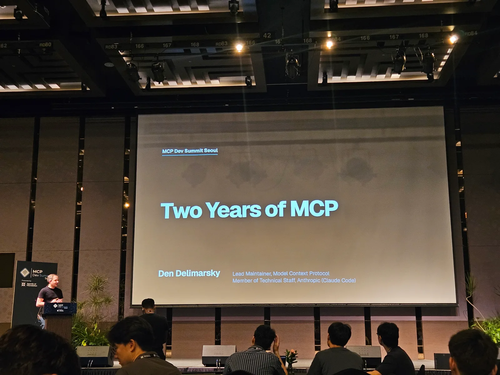
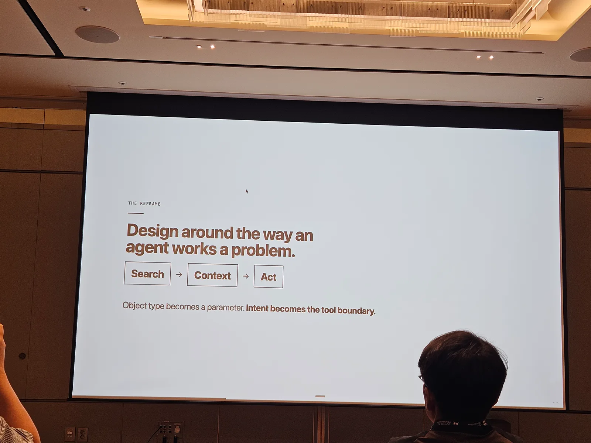
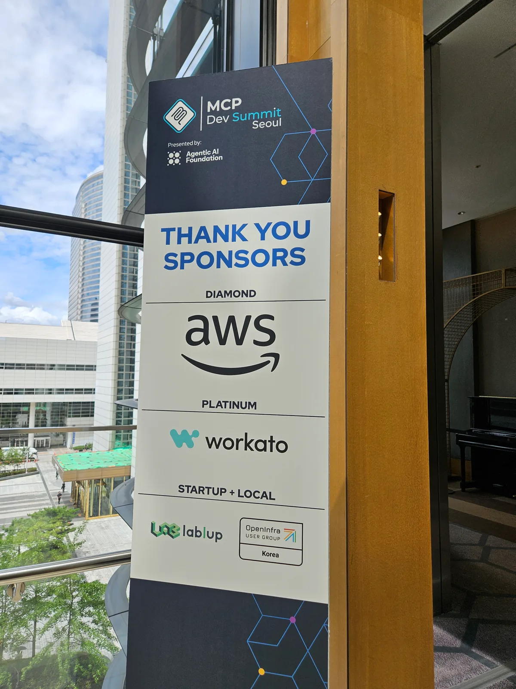
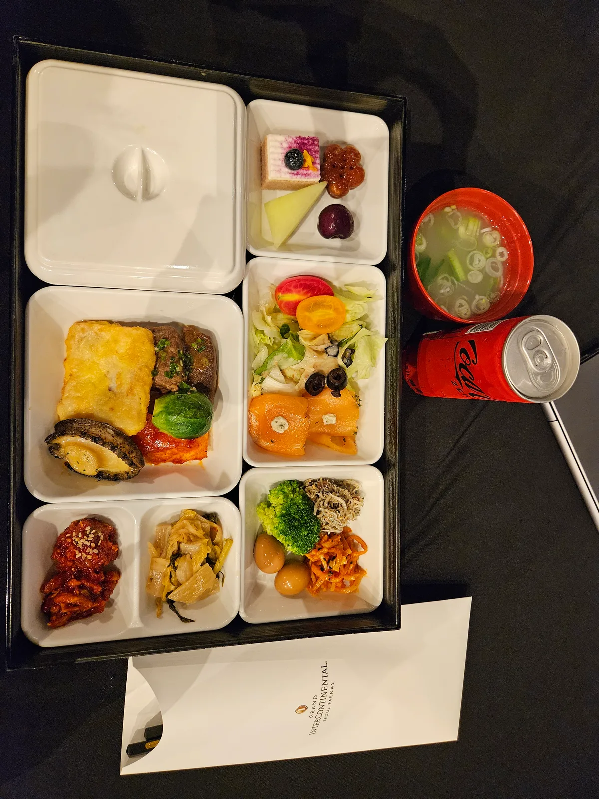
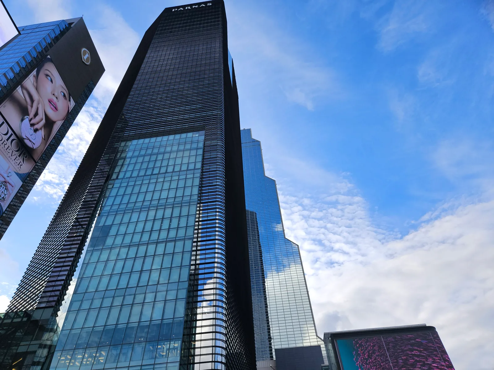
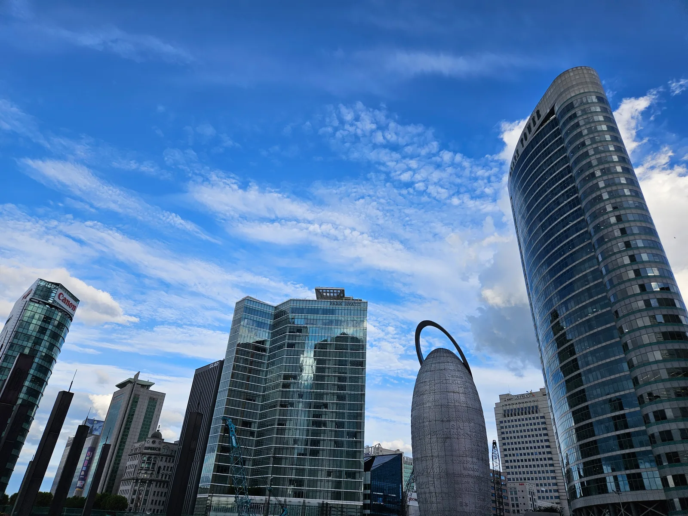
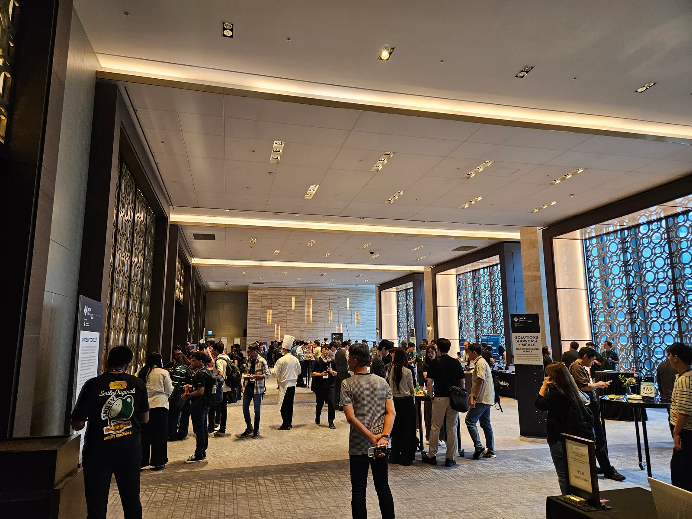

8월 13일(목)과 14일(금), 서울에서 열린 [MCP Dev Summit Seoul 2026](https://events.linuxfoundation.org/mcp-dev-summit-seoul/)에 다녀왔습니다.

에이전트를 개발하면서 MCP를 어디까지 적용할지, 기능을 어떻게 나눌지, 기존 API를 어떤 MCP 도구로 제공할지 고민해 왔습니다. 행사에서도 비슷한 문제를 다루는 발표가 많아 반가웠고, 다른 팀의 사례와 비교해 볼 수 있었습니다.

이틀 동안 들은 세션과 공통으로 나온 내용을 정리했습니다. 일부 세션은 공개 발표 자료로 보완했으며, 직접 참석한 범위를 함께 표시했습니다.

2026년 8월 13–14일 · 그랜드 인터컨티넨탈 서울 파르나스

<figure>

<figcaption>둘째 날 마지막 세션을 마친 뒤의 그랜드 볼룸.</figcaption>
</figure>

## 행사에서 반복해서 다뤄진 세 가지 주제

### 1. 모든 기능에 MCP가 필요한 것은 아니다

단일 함수 호출이나 절차가 정해진 작업에는 기존 API·CLI·템플릿·워크플로가 더 적합할 수 있다는 이야기가 여러 번 나왔습니다. 여러 에이전트가 공통으로 찾아 쓸 기능인지, 상태·승인·권한을 어디에서 관리할지가 판단 기준으로 제시됐습니다.

MCP를 적용하는 것 자체보다 해결하려는 문제에 맞게 에이전트의 역할과 실행 구조를 정하는 일이 중요하다는 점도 다시 확인했습니다.

### 2. 도구와 컨텍스트는 에이전트에 맞게 구성한다

도구 설계와 컨텍스트 사용량을 함께 다루는 발표가 많았습니다. API 기능을 그대로 노출하기보다 에이전트의 작업에 맞춰 도구를 구성하고, 필요한 스키마와 필드만 전달하는 방식이 공통으로 나왔습니다.

### 3. MCP를 연결한 뒤의 운영도 함께 설계한다

권한 검사와 승인 절차를 어디에 둘지, 에이전트가 어느 범위까지 실행할 수 있을지를 다룬 사례가 이어졌습니다. 근거가 부족한 요청을 처리하는 방법도 함께 다뤄졌습니다.

운영 단계에서는 실행 상태를 관리하는 방법과 감사 로그·트레이싱으로 동작을 확인하는 방법도 다뤘습니다. 재현 가능한 평가를 운영 설계에 포함해야 한다는 메시지도 이어졌습니다.

## 세션별 주요 내용

### 1일 차 — 8월 13일

#### Keynotes

<small>연사: Demetrios Brinkmann (Agentic AI Foundation) · Den Delimarsky (Anthropic) · Ana Jiménez Santamaría (Linux Foundation) · Jihye Kim (Naver Cloud Platform)</small>

MCP 생태계가 성장하면서 필요해진 레지스트리와 검색, 자격 증명, 가드레일, 감사 로그 등의 운영 체계를 다뤘습니다.

<figure>

<figcaption>첫날 키노트. Den Delimarsky(Anthropic)의 Two Years of MCP 발표.</figcaption>
</figure>

#### [Stateful AI Agents: Building Consistent Systems with MCP and Distributed SQL](https://mcpseoul2026.sched.com/event/2TLPA/stateful-ai-agents-building-consistent-systems-with-mcp-and-distributed-sql-nasiullha-chaudhari-yugabytedb)

<small>연사: Nasiullha Chaudhari (YugabyteDB)</small>

에이전트를 여러 구성 요소가 각각 실패할 수 있는 분산 시스템으로 보고, 기억과 실행 상태를 구분해 중복 실행을 막는 방법을 설명했습니다.

#### [From Legacy To Agentic AI](https://mcpseoul2026.sched.com/event/2PYeB/from-legacy-to-agentic-ai-seoyul-yoon-aaif-community-seoul)

<small>연사: Seoyul Yoon (AAIF Community Seoul)</small>

기존 OpenAPI 명세로 API를 MCP 도구로 자동 전환한 사례였습니다. 자동 변환 뒤에는 도구의 노출 범위와 설명을 다듬었습니다.

#### [From 40 Tools To 14: A Practical Framework for MCP Tool Curation](https://mcpseoul2026.sched.com/event/2PYeE/from-40-tools-to-14-a-practical-framework-for-mcp-tool-curation-nimit-savant-gokul-k-s-devrev)

<small>연사: Nimit Savant · Gokul K S (DevRev)</small>

DevRev는 MCP 도구를 40개에서 14개로 줄인 사례를 소개했습니다. 객체와 엔드포인트 중심으로 나열하던 도구를 에이전트의 의도와 작업 흐름에 맞춰 다시 구성했습니다.

발표 슬라이드에서도 도구를 `Search → Context → Act`의 흐름으로 묶어 설명했습니다.

<figure>

<figcaption>Nimit Savant와 Gokul K S(DevRev)의 From 40 Tools To 14 발표. 에이전트의 작업 흐름을 기준으로 도구를 재구성한 슬라이드.</figcaption>
</figure>

<figure>

<figcaption>점심시간에 담은 행사장 배너.</figcaption>
</figure>

<figure>

<figcaption>첫날 점심으로 나온 도시락.</figcaption>
</figure>

#### [Who Watches the Watchmen? Safe AI-Agent Failover Via MCP and CRDs](https://mcpseoul2026.sched.com/event/2PYeZ/who-watches-the-watchmen-safe-ai-agent-failover-via-mcp-and-crds-phuong-bac-ta-research-center-for-distributed-cloud-and-networking-ssu-south-korea-vitumbiko-mafeni-cnlab-ssu-iistrc)

<small>연사: Phuong Bac Ta (CNLab.ai) · Vitumbiko Mafeni (Research Center for Distributed Cloud and Networking)</small>

이 사례에서 에이전트는 상황을 관찰하고 대응안을 제안했습니다. 실제 변경은 사람이 승인한 뒤 기존 실행 체계가 처리하도록 역할을 나눴습니다.

#### [Authorization in MCP Systems: Getting It Right From the Start](https://mcpseoul2026.sched.com/event/2PYd1/authorization-in-mcp-systems-getting-it-right-from-the-start-aram-andreasyan-cerbos)

<small>연사: Aram Andreasyan (Cerbos) · 종료 직전까지 참석</small>

도구를 탐색할 권한과 실제 작업을 실행할 권한을 따로 통제하는 방법을 설명했습니다. 신원 확인과 권한 부여를 구분하는 내용도 함께 다뤘습니다.

#### [AAIF Ambassador AMA: Building the Agentic Future Through Community Contribution](https://mcpseoul2026.sched.com/event/2QScw/aaif-ambassador-ama-building-the-agentic-future-through-community-contribution-hoon-jo-megazone-daniel-oh-red-hat-ana-jimenenez-santamaria-linux-foundation-kevin-dubious-ibm-junghwan-park-pytorchkr)

<small>패널: Hoon Jo (Megazone) · Daniel Oh (Red Hat) · Ana Jiménez Santamaría (Linux Foundation) · Kevin Dubois (IBM) · Junghwan Park (PyTorchKR) · 마지막 부분만 참석</small>

관심 있는 AAIF 프로젝트와 워킹 그룹을 찾는 방법부터 제안·논의·직접 기여로 이어지는 참여 과정까지 소개했습니다.

#### [Stop Wrapping APIs: Building Structured Execution Boundaries With MCP for Incident Triage](https://mcpseoul2026.sched.com/event/2PYeW/stop-wrapping-apis-building-structured-execution-boundaries-with-mcp-for-incident-triage-sunyoung-park-kc-ml2)

<small>연사: Sunyoung Park (KC-ML2) · 시작 직후부터 참석, 공개 발표 자료 함께 참고</small>

데모에서는 근거를 확인할 수 없는 요청에 `INDETERMINATE`(판단 불가)를 반환했습니다. 근거가 부족하면 추정해서 답을 채우지 않고 판단을 유보하도록, 에이전트의 실행 범위를 제한한 사례였습니다.

#### [The Context Budget Crisis: Why MCP Needs Server-Side Response Controls](https://mcpseoul2026.sched.com/event/2PYdA/the-context-budget-crisis-why-mcp-needs-server-side-response-controls-nimit-savant-gokul-k-s-devrev)

<small>연사: Nimit Savant · Gokul K S (DevRev)</small>

도구 목록과 응답 전체를 매번 컨텍스트에 넣는 대신, 서버에서 필요한 정보만 선별해 전달하는 방식이었습니다.

#### [From APIs To Agentic Toolkits: Designing MCP Flavors and a Public MCP Gateway at Scale](https://mcpseoul2026.sched.com/event/2PYdM/from-apis-to-agentic-toolkits-designing-mcp-flavors-and-a-public-mcp-gateway-at-scale-faizan-akhtar-react-india)

<small>연사: Faizan Akhtar (React India)</small>

공개 MCP 게이트웨이의 외부 진입점과 내부 기능을 계층으로 나눈 사례였습니다. 계층마다 권한과 품질 기준을 적용하는 구조를 소개했습니다.

#### [Three Gateways for the Agentic Era: An Architectural Framework for Governing AI Agent Traffic](https://mcpseoul2026.sched.com/event/2PYdS/three-gateways-for-the-agentic-era-an-architectural-framework-for-governing-ai-agent-traffic-dakshitha-ratnayake-ws02)

<small>연사: Dakshitha Ratnayake (WSO2)</small>

API·LLM·MCP 트래픽을 구분하고, 각각의 위험과 정책을 관리할 통제 지점을 나눠 설명했습니다.

<figure>

<figcaption>첫날 세션을 마치고 나와서 본 파르나스.</figcaption>
</figure>

<figure>

<figcaption>해가 지기 전의 행사장 주변 풍경.</figcaption>
</figure>

### 2일 차 — 8월 14일

#### Day 2 Keynotes

<small>연사: HyunSoo Kim (Workato) · Woo Hyung Choi (AWS)</small>

기업 환경에서 MCP를 중앙 관리하고 상호운용하려면 신원, 권한, 거버넌스, 관측 가능성을 함께 갖춰야 한다는 내용을 다뤘습니다.

#### [The 5 Wrong Reasons to Build an MCP Server (And What to Do Instead)](https://mcpseoul2026.sched.com/event/2Rfp5/the-5-wrong-reasons-to-build-an-mcp-server-and-what-to-do-instead-daniel-oh-red-hat)

<small>연사: Daniel Oh (Red Hat)</small>

단순한 관심이나 막연한 보안 기대만으로 MCP 서버를 만들기보다, 여러 환경에 흩어진 기능을 공통으로 찾아 사용해야 하는지 등 실제 필요 조건부터 확인해야 한다는 메시지였습니다.

#### [When Does an Agentic Workflow Need MCP?](https://mcpseoul2026.sched.com/event/2PZo6/when-does-an-agentic-workflow-need-mcp-matching-intelligence-and-interfaces-to-the-outcome-junho-kong-sk-on)

<small>연사: Junho Kong (SK On)</small>

코딩 에이전트·템플릿·API·워크플로·MCP를 비교했습니다. 어떤 방식을 고를지는 작업의 불확실성과 반복성, 호출 주체, 승인 절차를 기준으로 판단했습니다.

#### [Skills and MCP: Complementary, Not Competing](https://mcpseoul2026.sched.com/event/2PYdk/skills-and-mcp-complementary-not-competing-dale-seo-apollo-graphql)

<small>연사: Dale Seo (Apollo GraphQL) · 전반부 참석, 이후 내용은 공개 발표 자료로 보완</small>

MCP를 실시간 시스템에 접근하는 수단으로, Skill을 도구 사용 절차와 전문 지식으로 구분하고 두 방식을 함께 활용하는 접근을 설명했습니다.

#### [Hardening MCP Integrations Against Tool Poisoning](https://mcpseoul2026.sched.com/event/2PYdh/hardening-mcp-integrations-against-tool-poisoning-arshardh-ifthikar-wso2)

<small>연사: Arshardh Ifthikar (WSO2) · 후반부 참석</small>

도구 설명과 응답뿐 아니라 여러 도구를 함께 사용할 때 생기는 위험까지 탐색 단계와 실행 단계에서 점검하는 방식을 다뤘습니다.

#### [Why We Made Our AI Agent Platform a Codebase Before Adding MCP](https://mcpseoul2026.sched.com/event/2PYdn/why-we-made-our-ai-agent-platform-a-codebase-before-adding-mcp-navtej-reddy-observeai)

<small>연사: Navtej Reddy (Observe.ai)</small>

이 사례에서는 에이전트 설정을 코드처럼 버전 관리했습니다. 변경 사항은 평가와 사람의 검토를 통과한 뒤 운영 환경에 반영했습니다.

#### [Closing the Context Gap: Making Your APIs Agent-Ready](https://mcpseoul2026.sched.com/event/2PYdw/closing-the-context-gap-making-your-apis-agent-ready-aanchal-mishra-postman-ali-mustafa-shaikh-pieces-ai)

<small>연사: Aanchal Mishra (Postman) · Ali Mustufa Shaikh (Pieces AI)</small>

API를 자동으로 연결하는 것보다, 에이전트가 입력 형식과 단위, 승인 조건, 결과의 의미를 추측하지 않도록 계약을 명확히 만드는 과정을 다뤘습니다.

#### [Managing Token Usage in MCP Servers Using Code Mode](https://mcpseoul2026.sched.com/event/2PYe5/managing-token-usage-in-mcp-servers-using-code-mode-bhumika-satpathy-google)

<small>연사: Bhumika Satpathy (Google)</small>

필요한 기능만 그때그때 찾아 실행하고, 중간 데이터는 실행 환경 안에서 처리하는 방식이었습니다. 도구 정보와 데이터가 차지하는 컨텍스트를 줄이는 데 초점을 맞췄습니다.

<figure>

<figcaption>둘째 날 마지막 세션 이후, 그랜드 볼룸 포이어의 네트워킹 현장.</figcaption>
</figure>

## 발표 자료와 영상

전체 프로그램과 공개 발표 자료는 [공식 일정표](https://mcpseoul2026.sched.com/)에서 확인할 수 있습니다. [공식 행사 페이지](https://events.linuxfoundation.org/mcp-dev-summit-seoul/)에서 안내하는 영상 링크도 함께 남깁니다.

- [Day 1 라이브스트림 다시 보기](https://www.youtube.com/watch?v=DMFDb1GCjKY)
- [Day 2 라이브스트림 다시 보기](https://www.youtube.com/watch?v=VSLSiW5JPAs)
- [Agentic AI Foundation YouTube 채널](https://www.youtube.com/@AgenticAI-Foundation)

<small>사진은 현장에서 직접 촬영했습니다. 사진 속 발표 자료의 출처는 각 세션의 발표자입니다.</small>
